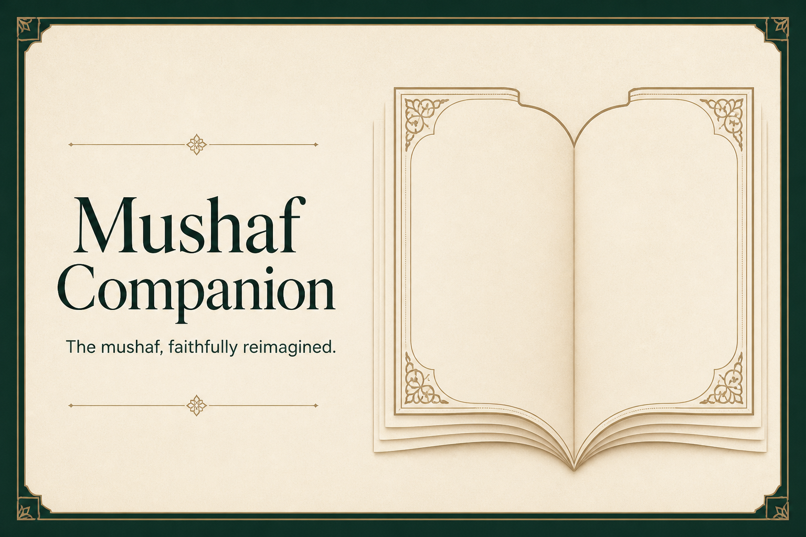

# Mushaf Companion

Mushaf Companion is a calm, page-first Quran reader designed to preserve the visual rhythm of the Madani mushaf while adding optional learning and recitation tools.

The current implementation supports all 604 Quran pages, direct page navigation, verse-level audio, tajweed display, transliteration, bookmarks, search, night mode, and last-read resume behavior.



## Live application

The current production deployment is private:

- [Mushaf Companion](https://mushaf-companion.abda-dc.chatgpt.site/)

## Product principles

- Page fidelity comes before feature density.
- The Arabic mushaf remains the primary reading surface.
- Translation, transliteration, tafsir, and audio are additive layers.
- Unverified Quran content must fail closed rather than render as trusted text.
- Controls should remain calm, reversible, and easy to dismiss.

## Current capabilities

### Mushaf reading

- Page-based reader covering pages 1–604.
- Uthmani text grouped into 15 fixed page-line slots using the authoritative Mushaf ID 1 mapping.
- Page-specific QCF V2 glyph fonts and QCF V4 Tajweed color fonts.
- Surah headings, bismillah lines, ayah markers, juz and hizb metadata.
- Previous and next page controls.
- Touch swipe navigation.
- Arrow, Page Up/Page Down, Home, and End keyboard navigation.
- Direct page-jump input.
- URL-addressable pages through `?page=<number>`.
- Adjacent-page prefetching.
- Last-read page and ayah persistence in local storage.

### Reading assistance

- Tajweed display toggle.
- Verse transliteration toggle.
- Selected-ayah state.
- Light and night themes.
- Reading-font picker with Uthman Taha, Amiri, Lateef, and Scheherazade.
- Explicit mobile Tajweed and Transliteration controls.
- Responsive settings panel with persisted display, learning, reciter, and speed preferences.

### Audio

- Mishary Rashid Alafasy.
- Abdul Basit Abdus Samad.
- Saad Al-Ghamdi.
- Dr. Aymen Suwayed.
- Minshawi Kids Repeat.
- Sheikh Abdul Rashid Ali Sufi.
- Verse play/pause and previous/next ayah controls.
- Playback progress and speed control.
- Repeat current ayah or a selected range on the current page.
- Stable mini-player plus a full transport/settings bottom sheet on mobile.
- Five reciters use ayah-by-ayah files; Sheikh Abdul Rashid Ali Sufi uses clearly labeled continuous sūrah playback because verified verse timing is not available from the source.

### Finding and saving places

- Search by page number, ayah key, surah name, or Quran text.
- Page and ayah search results.
- Ayah bookmarks.
- Resume from the last confirmed page and ayah.

## Architecture

Mushaf Companion is a full-stack React application built with Next-compatible App Router conventions through vinext and Vite. Client and API routes are served by one process.

```text
Browser reader
  ├─ /api/pages/:page  ── verified page, line, tajweed and transliteration data
  ├─ /api/search       ── page, surah and verse search
  ├─ /api/lookup       ── verse-to-page mapping
  └─ audio providers   ── verse-level recitation files
```

The page API obtains content from the Quran Foundation/Quran.com Content API, validates required payloads, aligns tajweed markup to words, and returns a normalized page model. Content-fetch failures return an error response; they are not silently presented as verified Quran text.

## Local development

### Prerequisites

- Node.js `>=22.13.0`
- npm

### Install and run

```bash
npm ci
npm run dev
```

Open [http://localhost:5550](http://localhost:5550).

The frontend and all `/api/*` routes use the same full-stack server on port `5550`.

### Useful commands

```bash
npm run dev      # Start the development server on port 5550
npm run build    # Create a production build
npm run start    # Run the production build on port 5550
npm test         # Build and run the reader/API test suite
npm run lint     # Run ESLint
```

No application environment variables are required for the current read-only Quran API integration.

## API routes

| Route | Purpose | Important behavior |
| --- | --- | --- |
| `GET /api/pages/:page` | Load one Madani mushaf page | Accepts pages 1–604 and fails closed on incomplete upstream content. |
| `GET /api/search?q=` | Search pages, ayat, surahs, and text | Falls back to direct page and ayah matching if broad search is unavailable. |
| `GET /api/lookup?verse=` | Resolve an ayah key to its page | Accepts keys such as `2:255`. |

## Repository layout

```text
app/
  api/                 Server-side Quran data adapters
  globals.css          Reader, audio, modal, mobile, and theme styling
  page.tsx             Mushaf reader and interaction state
  quran-data.ts        Shared page, verse, reciter, and search types
docs/
  ANALYTICS.md         Future analytics and event contract
  ROADMAP.md           Prioritized translations, tafsir, and offline roadmap
  UX-REVIEW.md         Current reader UX findings and acceptance checks
tests/
  rendered-html.test.mjs
worker/
  index.ts             Cloudflare/vinext worker entry point
```

## Data integrity expectations

Before a content source or edition is enabled in production, it must have:

- A stable source and edition identifier.
- Documented licensing and attribution.
- Complete surah, ayah, page, and line mappings.
- Automated coverage checks for all 604 pages.
- Sanitization for any markup returned by a content provider.
- Human review of representative page, surah-boundary, sajdah, and long-ayah cases.

The bundled Al-Fatihah model is only a fail-safe initial shell while the selected verified page loads. It is not a substitute for successful page retrieval.

## Current limitations

- Translation and tafsir panels are not implemented yet.
- Audio requires a network connection and cannot be downloaded yet.
- Offline reading is not supported.
- The QCF page geometry still needs representative screenshot regression coverage before it should be described as pixel-identical on every supported browser and device.
- Bookmarks and preferences are local to the current browser.

## Product planning

- [V2 roadmap](./docs/ROADMAP.md)
- [Current UX review](./docs/UX-REVIEW.md)
- [Analytics requirements](./docs/ANALYTICS.md)
- [Product changelog](./CHANGELOG.md)

## Deployment

The application is designed for a server-capable deployment because page, search, and lookup endpoints run on the server. A static-only host such as GitHub Pages cannot run the complete application without replacing those routes with another backend.

The current production deployment uses a private OpenAI Sites project backed by a Cloudflare-compatible vinext build.

## License

No software license file is currently included. Quran text, translations, tafsir, typography, and recitation assets must retain the terms and attribution required by their respective providers.
